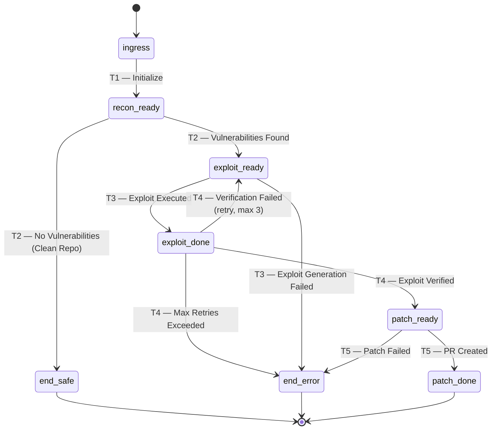

# AEGIS

### Autonomous Exploit Generation & Intelligence Security

An autonomous, fail-closed red-team engine that discovers, exploits, verifies, and patches security vulnerabilities — then opens a Pull Request with the fix — all with zero human intervention and full end-to-end observability.

---

[Live Demo](#) | [Demo Video](#) | [Architecture](#system-architecture) | [Getting Started](#getting-started) | [How It Works](#how-it-works)

---

</div>

## Table of Contents

- [Problem Statement](#problem-statement)
- [The Solution](#the-solution)
- [System Architecture](#system-architecture)
- [Key Differentiators](#key-differentiators)
- [How It Works](#how-it-works)
  - [End-to-End Pipeline Flow](#end-to-end-pipeline-flow)
  - [Colored Petri Net (CPN) Execution Model](#colored-petri-net-cpn-execution-model)
  - [Agent Breakdown](#agent-breakdown)
  - [SSE Event Lifecycle](#sse-event-lifecycle)
- [Evaluation Criteria Alignment](#evaluation-criteria-alignment)
- [Technical Stack](#technical-stack)
- [Project Structure](#project-structure)
- [Fail-Closed Safety Mechanisms](#fail-closed-safety-mechanisms)
- [Getting Started](#getting-started)
  - [Prerequisites](#prerequisites)
  - [Step 1 — Configure the Backend](#step-1--configure-the-backend)
  - [Step 2 — Start Redis](#step-2--start-redis)
  - [Step 3 — Start the Backend](#step-3--start-the-backend)
  - [Step 4 — Start the Frontend](#step-4--start-the-frontend)
  - [One-Command Launch](#one-command-launch)
- [API Reference](#api-reference)
- [Observability and Tracing](#observability-and-tracing)
- [Data Contracts](#data-contracts)
- [Future Scope and Scalability](#future-scope-and-scalability)
- [License](#license)

---

## Problem Statement

Modern software teams ship code at velocity, but security remediation remains painfully manual. Existing vulnerability scanners generate reports that sit in backlogs for weeks. When AI-powered agents attempt autonomous fixing, they face three critical failure modes:

1. **Hallucination** — LLM agents fabricate vulnerability findings or generate patches that introduce new bugs, with no mechanism to distinguish real exploits from imagined ones.
2. **Death Spirals** — Agents without deterministic routing enter infinite retry loops, consuming resources without converging on a solution.
3. **Black-Box Execution** — Without production-grade observability, teams cannot audit what the agent did, why it made a decision, or where it failed — making autonomous agents a liability rather than an asset.

These problems are not hypothetical. They are the primary reasons security teams distrust autonomous agents in production environments.

---

## The Solution

AEGIS eliminates all three failure modes through a mathematically grounded architecture:

- **A Colored Petri Net (CPN) execution engine** replaces free-form agent chaining with deterministic, graph-based orchestration. The LLM is never consulted for routing decisions — pure Python `if/else` logic governs all state transitions.
- **A dedicated Verifier Agent** (zero LLM dependency) acts as a cryptographic checkpoint: exploit output must contain deterministic proof markers (`FLAG{...}` or `EXPLOIT_SUCCESS`) before the pipeline advances. This is the anti-hallucination gate.
- **Full W3C Trace Context propagation** via the Omium SDK across every asynchronous boundary (FastAPI to background threads), producing a single connected distributed trace for the entire pipeline. Every decision, every token, every sandbox execution is auditable.

The result: a system that autonomously clones a GitHub repository, scans its source code, generates and executes exploit payloads in a sandboxed environment, deterministically verifies exploitation, generates a security patch, and opens a Pull Request — all visible in real-time through Server-Sent Events streamed to a production-quality web dashboard.

---

## System Architecture


---

## Key Differentiators

### Production-Grade Observability (Omium SDK + W3C Trace Context)

AEGIS does not operate as a black box. Every pipeline execution emits structured OpenTelemetry spans with rich attributes — `cpn.transition`, `cpn.step`, `cpn.retry_count`, `llm.prompt_tokens`, `sandbox.stdout_length`, `verification.result`, and `patch.confidence`. The Omium SDK exports traces via OTLP gRPC to `ingest.monium.yandex.cloud:443`.

Critically, **W3C Trace Context is propagated across asynchronous boundaries** (from the FastAPI request handler into `asyncio.to_thread` and through the CPN engine), ensuring the entire multi-agent pipeline — from the initial HTTP request to the final GitHub PR — appears as a single, connected distributed trace. This is not bolted-on logging; it is first-class, standards-compliant observability.

### Fail-Closed and Deterministic Architecture

The Verifier Agent is intentionally **not an LLM**. It is pure deterministic Python that performs three cryptographic checks:
1. `vulnerability_confirmed` must be `True`
2. `sandbox_stdout` must contain `EXPLOIT_SUCCESS` or `FLAG{`
3. If `extracted_secret` is set, a strict regex (`FLAG\{[A-Za-z0-9_\-]+\}`) must match in stdout

If any check fails, the pipeline retries the exploit (up to 3 attempts) or halts at a terminal error state. The LLM cannot talk its way past verification. This is the anti-hallucination checkpoint that prevents false positives from reaching the patch stage.

### Deterministic Graph Routing via Colored Petri Net

Unlike agent frameworks that use LLMs for routing (introducing non-determinism at the orchestration layer), ANVIL uses a formal Colored Petri Net with 10 places and 5 transitions. All routing decisions are encoded as Python guard conditions. The LLM is confined to its designated role — generating analysis, payloads, and patches — never deciding what happens next.

### Real-World Integration, Not Mock Services

AEGIS operates against real APIs:
- **GitHub REST API** via PyGithub — clone repos, create branches, push commits, open Pull Requests using the authenticated user's OAuth token
- **GitHub OAuth 2.0** — full authorization code flow with signed HttpOnly cookies
- **OpenAI GPT-4o** — structured JSON output with Pydantic validation for all agent responses
- **Real-time SSE streaming** — not polling, not WebSocket emulation, but proper `text/event-stream` via `sse-starlette`

### How AEGIS Outperforms Existing Security Agents

While many AI security tools stop at static analysis or simple patch generation, ANVIL solves the fundamental flaws of first-generation AI agents:

| Feature | Existing AI Security Agents | **AEGIS (Our Agent)** |
|---------|---------------------------|-----------------------|
| **Orchestration** | **Non-deterministic LLM routing** (ReAct/Chain-of-Thought). Prone to infinite loops, getting stuck, and unpredictable execution paths. | **Colored Petri Net (CPN)**. 100% deterministic, mathematically sound state machine with hard retry limits. The LLM does the thinking; Python does the routing. |
| **Verification** | **LLM-based validation** ("Did this patch work? Yes!"). High risk of hallucinated success where the agent lies to itself. | **Cryptographic Verification Gate**. Pure deterministic Python checking for sandbox execution stdout markers (`FLAG{...}`). Zero LLM hallucination surface. |
| **Execution** | **Theoretical patching**. Agents generate fixes based on assumed vulnerabilities without proving exploitability. | **Live Sandbox Exploitation**. ANVIL writes an actual Python exploit, fires it at an isolated sandbox, and *proves* the vulnerability exists before patching. |
| **Observability** | **Black-box execution**. Terminal logs only. Impossible to trace token usage, exact prompts, or decision trees across distributed boundaries. | **Omium SDK + W3C Trace Context**. Every action emits structured OpenTelemetry spans. The entire async pipeline is a single, visualizable distributed trace. |
| **Safety** | **Runaway execution**. Agents can hallucinate dangerous system commands (`rm -rf`) if given execution access. | **AST-Validated Sandbox**. Fail-closed code execution filtering dangerous imports and calls, combined with a SHA-256 circuit breaker for exploit deduplication. |

---

## How It Works

### End-to-End Pipeline Flow

```
User authenticates via GitHub OAuth
        |
        v
User enters repository URL and clicks "Start Scan"
        |
        v
POST /api/scan --> Pipeline Runner (asyncio.to_thread)
        |
        v
    [1] Clone repository via GitHub API (authenticated HTTPS)
        |
        v
    [2] Recon Agent: GPT-4o analyzes source code for vulnerabilities
        |
        v
    [3] Exploit Agent: GPT-4o generates Python exploit payload
        |               --> AST validation (block dangerous constructs)
        |               --> Sandboxed subprocess execution (env={}, 5s timeout)
        |
        v
    [4] Verifier Agent: Deterministic stdout analysis (NO LLM)
        |         |
        |     [FAIL] --> Retry (up to 3x) --> back to [3]
        |
        v
    [5] Patcher Agent: GPT-4o generates security fix
        |               --> Create fix/ branch via GitHub API
        |               --> Push patched files
        |               --> Open Pull Request
        |
        v
    SSE event: "completed" with PR URL --> Frontend renders results
```

### Colored Petri Net (CPN) Execution Model

The CPN is the formal orchestration backbone. It defines a bipartite graph of **Places** (system states) and **Transitions** (agent actions), with the `MasterState` Pydantic model serving as the "coloured token" that flows through the net.



**Terminal places**: `patch_done` (success), `end_safe` (no vulnerabilities), `end_error` (pipeline failure)

**Safety limits**: 20-step absolute maximum prevents infinite graph traversal. 3-retry circuit breaker at verification prevents exploit-verify death spirals.

### Agent Breakdown

| Agent | Role | LLM | Key Mechanism |
|-------|------|-----|---------------|
| **Recon Agent** | Analyze cloned source code for security vulnerabilities | GPT-4o | Structured JSON output validated against `ReconOutput` schema; deterministic fallback if LLM returns invalid data |
| **Exploit Agent** | Generate standalone Python exploit payload | GPT-4o | AST-validated sandbox execution with import/call filtering, stripped env, 5s timeout, SHA-256 dedup circuit breaker |
| **Verifier Agent** | Deterministically confirm exploitation | None | Pure Python — regex matching for `FLAG{...}` and `EXPLOIT_SUCCESS` markers; zero hallucination surface |
| **Patcher Agent** | Generate security fix and open GitHub PR | GPT-4o | Creates `fix/` branch via GitHub API, pushes patched files, opens PR with vulnerability report and confidence score |

### SSE Event Lifecycle

```
queued --> cloning --> recon --> exploit --> verify --> patch --> pushing --> completed
                                              ^                   |
                                              |   retry loop      |
                                              +----(max 3x)-------+
```

Each event payload:
```json
{
  "scan_id": "a1b2c3d4e5f6",
  "stage": "verify",
  "status": "running",
  "message": "Verifying exploit (deterministic)...",
  "detail": null,
  "pr_url": null,
  "vuln_count": 2,
  "progress_pct": 60
}
```

---

## Evaluation Criteria Alignment

This section maps AEGIS's architecture directly to the hackathon evaluation rubric to demonstrate maximum alignment with each scoring criterion.

| Criterion | How AEGIS Addresses It |
|-----------|----------------------|
| **Autonomy** | The entire pipeline — from repository cloning through vulnerability discovery, exploitation, verification, patching, and Pull Request creation — executes without any human intervention. The user provides a repo URL; ANVIL delivers a fix PR. Zero manual steps. |
| **Observability** | Every CPN transition, LLM call, sandbox execution, and verification decision emits structured OpenTelemetry spans via the Omium SDK. W3C Trace Context propagation across async boundaries produces a single connected trace for the full pipeline. This is not logging — it is production-grade distributed tracing. |
| **Reliability** | The fail-closed architecture prevents runaway execution: AST-validated sandbox blocks dangerous code before execution; deterministic Verifier rejects hallucinated results; SHA-256 circuit breaker prevents identical payload retries; 3-retry cap prevents death spirals; 20-step CPN limit prevents infinite traversal; SQLite WAL checkpointing after every transition enables crash recovery. |
| **Real-World Integration** | Anvil operates against live GitHub repositories using the GitHub REST API (OAuth, clone, branch, commit, PR) and OpenAI GPT-4o. No mock services, no simulated APIs. |
| **Technical Complexity** | Multi-agent CPN orchestration, AST-based code sandboxing, W3C trace propagation across async boundaries, real-time SSE streaming, signed cookie authentication, and strict Pydantic v2 inter-agent contracts — all integrated into a cohesive, production-quality system. |

---

## Technical Stack

### Frontend
| Technology | Purpose |
|-----------|---------|
| React 18 | Component-based UI with hooks |
| Vite 5 | Development server with HMR |
| CSS Modules | Scoped, maintainable styling |
| Server-Sent Events (SSE) | Real-time pipeline progress streaming |
| Petri Net Visualizer | Visual CPN state representation |
| Diff Viewer | Side-by-side patch visualization |

### Backend and Orchestration
| Technology | Purpose |
|-----------|---------|
| FastAPI | Async HTTP API with automatic OpenAPI docs |
| Python 3.11+ (asyncio) | Async pipeline execution via `asyncio.to_thread` |
| Colored Petri Net Engine | Deterministic multi-agent orchestration (custom) |
| SQLite (WAL mode) | Durable state checkpoints after every CPN transition |
| Redis | SSE event queue for real-time streaming |
| Pydantic v2 | Strict JSON schema enforcement on all inter-agent data |
| AST Sandbox | Fail-closed code execution with import/call filtering |

### Integrations
| Service | Purpose |
|---------|---------|
| OpenAI GPT-4o | LLM backbone for Recon, Exploit, and Patcher agents |
| GitHub REST API (PyGithub) | Repository operations: clone, branch, commit, Pull Request |
| GitHub OAuth 2.0 | User authentication with signed HttpOnly cookies |
| Omium SDK (OTLP gRPC) | Distributed tracing with W3C Trace Context propagation |
| sse-starlette | Server-Sent Events for real-time frontend updates |

---

## Project Structure

```
anvil/
|
+-- frontend/                        # React + Vite dashboard
|   +-- src/
|       +-- components/
|       |   +-- NavBar.jsx           # Navigation with auth state
|       |   +-- HeroSection.jsx      # Landing page hero
|       |   +-- GitHubConnect.jsx     # OAuth connection flow
|       |   +-- RepoInput.jsx        # Repository URL input + scan trigger
|       |   +-- PetriNet.jsx         # Real-time CPN state visualizer
|       |   +-- Terminal.jsx         # Live SSE event terminal
|       |   +-- DiffViewer.jsx       # Side-by-side patch diff
|       |   +-- ScanComplete.jsx     # Results summary with PR link
|       |   +-- Architecture.jsx     # System architecture display
|       |   +-- Footer.jsx           # Footer component
|       +-- hooks/                   # Custom React hooks (SSE, auth)
|       +-- api/                     # API client functions
|       +-- App.jsx                  # Root component + routing
|       +-- index.css                # Global design system
|
+-- backend/
|   +-- app/
|   |   +-- main.py                  # FastAPI application + CORS + router mount
|   |   +-- api.py                   # Scan REST endpoints + SSE streaming
|   |   +-- auth.py                  # GitHub OAuth router (4 endpoints)
|   |   +-- pipeline.py             # Async pipeline runner + event emitter
|   |   +-- graph.py                 # CPN engine: Places, Transitions, routing
|   |   +-- sandbox.py              # AST-validated subprocess sandbox
|   |   +-- schemas.py              # 12 Pydantic v2 data contracts
|   |   +-- db.py                    # SQLite WAL checkpointing + execution log
|   |   +-- config.py               # Central configuration (env vars)
|   |   +-- telemetry.py            # Omium/OTLP exporter + W3C propagation
|   |   +-- github_service.py       # GitHub API: clone, branch, PR
|   |   +-- celery_app.py           # Celery broker (Redis-backed)
|   |   +-- state_synchronizer.py   # Redis Stream to SQLite merge daemon
|   |   +-- tasks.py                # Celery task bridge
|   |   +-- agents/
|   |       +-- recon.py            # Agent 1: Source code vulnerability analysis
|   |       +-- exploiter.py        # Agent 2: Exploit generation + sandbox
|   |       +-- verifier.py         # Verifier: Deterministic (NO LLM)
|   |       +-- patcher.py          # Agent 3: Fix generation + GitHub PR
|   +-- target_app/                  # Intentionally vulnerable Flask server
|   +-- tests/                       # Sandbox TDD tests (7/7 passing)
|   +-- requirements.txt            # Python dependencies
|   +-- .env.example                 # Environment variable template
|
+-- start.sh                        # One-command launcher (Redis + backend + frontend)
```

---

## Fail-Closed Safety Mechanisms

AEGIS enforces security at every layer. If any validation step fails, the system **refuses to proceed** (fail-closed).

| Layer | Mechanism | Implementation | What It Prevents |
|-------|-----------|---------------|-----------------|
| Sandbox | AST Import Filtering | Blocks `shutil`, `ctypes`, `subprocess`, `multiprocessing`, `signal`, `importlib` before execution | Dangerous system-level imports in LLM-generated code |
| Sandbox | AST Call Filtering | Blocks `os.remove`, `os.system`, `os.fork`, `eval`, `exec`, `subprocess.run` | Destructive operations and arbitrary code execution |
| Sandbox | Stripped Environment | `env={}` passed to `subprocess.run` | Environment variable leakage (API keys, credentials) |
| Sandbox | Hard Timeout | 5-second `timeout` on subprocess execution | Infinite loops and resource exhaustion |
| Sandbox | SHA-256 Dedup | Hash-based circuit breaker blocks identical payloads after 3 failures | Retrying the same broken exploit indefinitely |
| CPN | Max Steps | 20-step absolute limit on graph traversal | Infinite state machine loops |
| CPN | Retry Circuit Breaker | Maximum 3 retries at the verification gate | Exploit-Verify death spiral |
| Schemas | Pydantic v2 Strict Mode | All inter-agent data validated against typed contracts | Context poisoning and malformed data propagation |
| State | SQLite WAL Checkpoints | Full state serialized after every CPN transition | Data loss on crash; enables recovery |
| Auth | Signed HttpOnly Cookies | `itsdangerous.URLSafeSerializer` with configurable secret | Session hijacking and token theft |

---

## Getting Started

### Prerequisites

| Requirement | Check | Install |
|------------|-------|---------|
| Python 3.11+ | `python3 --version` | [python.org](https://www.python.org/downloads/) |
| Node.js 20+ | `node --version` | [nodejs.org](https://nodejs.org/) |
| Redis | `redis-cli ping` | macOS: `brew install redis` / Ubuntu: `sudo apt install redis-server` |
| OpenAI API Key | — | [platform.openai.com](https://platform.openai.com/api-keys) |
| GitHub OAuth App | — | [github.com/settings/developers](https://github.com/settings/developers) |

When creating the GitHub OAuth App, set:
- **Homepage URL**: `http://localhost:5173`
- **Authorization callback URL**: `http://localhost:8000/api/auth/callback`

---

### Step 1 — Configure the Backend

```bash
cd backend
cp .env.example .env
```

Edit `backend/.env` and fill in your credentials:

```env
OPENAI_API_KEY=sk-your-key-here
GITHUB_CLIENT_ID=your_client_id
GITHUB_CLIENT_SECRET=your_client_secret
SESSION_SECRET=run: python -c "import secrets; print(secrets.token_hex(32))"
```

All other values (Redis URL, SQLite path, Omium endpoint) have sensible defaults.

---

### Step 2 — Start Redis

```bash
# macOS / Linux
redis-server

# Or as a background daemon:
redis-server --daemonize yes

# Verify:
redis-cli ping    # Expected output: PONG
```

---

### Step 3 — Start the Backend

```bash
cd backend
pip install -r requirements.txt
uvicorn app.main:app --host 0.0.0.0 --port 8000 --reload
```

The API documentation will be available at: `http://localhost:8000/docs`

---

### Step 4 — Start the Frontend

Open a new terminal:

```bash
cd frontend
npm install
npm run dev
```

The application will be available at: `http://localhost:5173`

---

### One-Command Launch

Alternatively, use the included launcher script that handles Redis, backend, and frontend in one step:

```bash
chmod +x start.sh
./start.sh
```

---

## API Reference

| Method | Path | Auth | Description |
|--------|------|------|-------------|
| `GET` | `/api/auth/github` | No | Redirect to GitHub OAuth authorization |
| `GET` | `/api/auth/callback` | No | OAuth code exchange, sets signed cookie |
| `GET` | `/api/auth/me` | Yes | Returns authenticated GitHub user profile |
| `POST` | `/api/auth/logout` | No | Clears session cookie |
| `POST` | `/api/scan` | Yes | Start scan `{"repo_url": "...", "base_branch": "main"}` |
| `GET` | `/api/scan/{id}/stream` | No | SSE stream of real-time `ScanEvent` objects |
| `GET` | `/api/scan/{id}` | No | Full `ScanResult` for a completed scan |
| `GET` | `/api/scans` | Yes | List all scans for current session |
| `GET` | `/health` | No | Health check endpoint |

---

## Observability and Tracing

ANVIL exports distributed traces via the Omium SDK using the OTLP gRPC protocol. Every span includes structured attributes:

| Span Category | Attributes |
|--------------|------------|
| CPN Engine | `cpn.transition`, `cpn.step`, `cpn.retry_count`, `cpn.final_node`, `cpn.total_steps` |
| LLM Calls | `llm.prompt_tokens`, `llm.completion_tokens`, `agent.decision_rationale` |
| Sandbox | `tool.execution_status`, `sandbox.stdout_length` |
| Verification | `verification.result` (`VERIFIED` / `REJECTED`) |
| Patch | `patch.branch`, `patch.confidence` |

**W3C Trace Context Propagation**: The `traceparent` header is injected at the FastAPI ingress and extracted across async boundaries, ensuring the full pipeline (HTTP request, background thread, CPN transitions, agent executions) appears as one connected trace.

```
FastAPI Request --> trace_operation("scan_pipeline")
    --> asyncio.to_thread --> trace_operation("cpn_engine_run")
        --> trace_operation("transition:t2_run_recon")
        --> trace_operation("transition:t3_run_exploit")
        --> trace_operation("transition:t4_verify")
        --> trace_operation("transition:t5_run_patch")
```

---

## Data Contracts

All inter-agent communication is governed by strict Pydantic v2 schemas. No free-form text passes between agents.

| Schema | Producer | Consumer | Fields |
|--------|----------|----------|--------|
| `WebhookPayload` | API Layer | Pipeline | `target_url`, `deployment_id`, `repo_url` |
| `ReconOutput` | Recon Agent | Exploit Agent | `target_url`, `detected_framework`, `vulnerable_endpoints[]` |
| `ExploitOutput` | Exploit Agent | Verifier | `vulnerability_confirmed`, `exploit_payload_used`, `sandbox_stdout`, `extracted_secret` |
| `VerificationResult` | Verifier | Patcher (gate) | `verified`, `reason`, `expected_pattern`, `actual_value` |
| `PatchOutput` | Patcher Agent | Results | `file_modified`, `unified_diff`, `pr_url`, `confidence_score` |
| `MasterState` | CPN Engine | All Agents | The coloured token: carries all accumulated state through the net |
| `ScanEvent` | Pipeline | Frontend (SSE) | `scan_id`, `stage`, `status`, `message`, `pr_url`, `progress_pct` |

---

## Future Scope and Scalability

ANVIL was designed as a production-capable foundation, not a hackathon prototype. The architecture supports the following V2 enhancements:

| Enhancement | Description |
|------------|-------------|
| **CI/CD Pipeline Integration** | Trigger scans automatically on push/PR events via GitHub Webhooks, integrating ANVIL into existing DevSecOps workflows |
| **Multi-Platform Support** | Extend GitHub integration to GitLab, Bitbucket, and Azure DevOps using a provider abstraction layer |
| **Expanded Skill Repository** | Add detection modules for OWASP Top 10 categories beyond path traversal: SQL injection, XSS, SSRF, insecure deserialization |
| **Parallel Multi-Vulnerability Scanning** | Fork the CPN into parallel sub-nets, one per vulnerability, enabling simultaneous exploitation and patching |
| **Persistent Scan History** | Replace in-memory scan registry with PostgreSQL for multi-session, multi-user scan history and analytics |
| **Role-Based Access Control** | Extend OAuth to support team-based access with repository-level permissions |
| **Custom Policy Engine** | Allow teams to define which vulnerability classes trigger auto-patching vs. manual review |
| **Container-Based Sandbox** | Upgrade from AST-validated subprocess to gVisor or Firecracker micro-VMs for stronger isolation |

---

## License

This project was built for the Multi-Agent Autonomy Hackathon (PS3 Track).

---

<div align="center">

**Built with a focus on autonomy, reliability, and full observability.**

AEGIS — Because vulnerabilities should not wait for humans.

</div>
